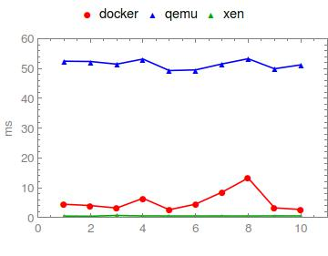
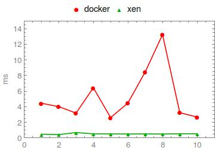

# Overview

This is zeromq 4.2.2 for rumprun. The test platform is running Ubuntu 16.04 and the compilation options include ```-std=c++17```.

## Maintainer

* Bela Berde, bela.berde@gmail.com
* Github: @kvart2006

## Instructions
Use the included``Makefile`` by typing ```make```. Note that ```libtool``` is required to run ```autogen.sh```.

## Examples

In order to run an example application on rumprun, you have to provide the paths to the ```zmq.h``` header file and the ```libzmq``` library during compilation: 

```
$ x86_64-rumprun-netbsd-gcc <filename>  -I <path-to-zeromq-package>/include \
-L <path-to-zeromq-package>/lib -lpthread -lzmq -o <filename-output>
```
Example (testing):
```
<path-to-zeromq-package>/lib = /root/git/rumprun-packages/pkgs/lib
<path-to-zeromq-package>/include = /root/git/rumprun-packages/pkgs/include

x86_64-rumprun-netbsd-g++ -std=c++17 example1.cpp  -I/root/git/rumprun-packages/pkgs/include -L/root/git/rumprun-packages/pkgs/lib -lpthread -lzmq -o example1-rr

rumprun-bake hw_generic example1-rr.bin example1-rr

rumprun qemu -i example1-rr.bin
```
All other steps (baking, running) remain the same.

### Example 1
A simple one-way zeromq messaging using ZMQ_REQ and ZMQ_REP. 

### Example 2
A simple one-way zeromq messaging using ZMQ_DEALER (asynchronos). 


## Benchmark
The rumprun xen benchmark is against docker and rumprun qemu. All the tests are performed in Virtualbox by simply running the ```exemple1``` 10 times. Note that the goal here is to have a first performance trend, and not to globally evaluate rumprun performance.

### Benchmark 1
The first test's Dockerfile requires the ```example1``` executable compiled and built as
```
g++ -std=c++17 example1.cpp -lpthread -lzmq -o example1
```
The Dockerfile is attached.

The first figure shows the difference in performance of rumprun qemu and rumprun xen.   

<div align="center">
        </img>
</div>
The second figure says that rumprun xen performs, at least, more than five times faster than docker. 

<div align="center">
        </img>
</div>
